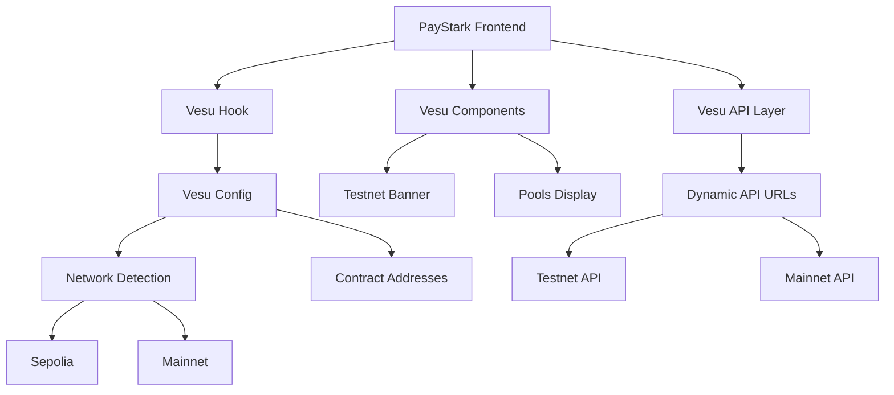

# 🚀 Vesu Testnet Integration - PayStark

## 📋 Overview

This document outlines the complete integration of Vesu pools in testnet mode for the PayStark application. The integration provides seamless switching between mainnet and testnet environments, allowing developers and users to test Vesu functionality safely.

## 🏗️ Architecture

### Integration Components



## 🔧 Implementation Details

### 1. Configuration System

#### **Vesu Configuration (`lib/vesu-config.ts`)**
- Centralized configuration for both testnet and mainnet
- Dynamic network detection
- Contract address management
- API endpoint configuration

```typescript
// Testnet Configuration
export const VESU_TESTNET_CONFIG: VesuConfig = {
  apiUrl: 'https://api-testnet.vesu.xyz',
  singletonAddress: '0x01ecab07456147a8de92b9273dd6789893401e8462a737431493980d9be6827',
  extensionAddress: '0x0571efca8cae0e426cb7052dad04badded0855b4cd6c6f475639af3356bc33fe',
  wbtcAddress: '0xabbd6f1e590eb83addd87ba5ac27960d859b1f17d11a3c1cd6a0006704b1410',
  genesisPoolId: '730993554056884283224259059297934576024721456828383733531590831263129347422',
  network: 'testnet',
};
```

#### **Constants Update (`constants/index.ts`)**
- Added Vesu contract addresses for both networks
- Dynamic API URL configuration
- Network-specific pool configuration

### 2. API Layer Enhancement

#### **Vesu API (`app/api/vesuApi.ts`)**
- Dynamic API URL switching based on network
- Enhanced error handling
- Risk level calculation
- Network-aware data fetching

```typescript
// Dynamic API URL based on network
const config = getCurrentVesuConfig();
const { data } = await axios.get(
  buildVesuApiUrl(`${VESU_ENDPOINTS.POSITIONS}?walletAddress=${address}`)
);
```

### 3. React Hooks

#### **Vesu Hook (`hooks/use-vesu.ts`)**
- Centralized state management for Vesu integration
- Network switching capabilities
- Automatic data refresh
- Error handling and loading states

```typescript
export function useVesu(): VesuHookState & VesuHookActions {
  // Provides:
  // - config: Current Vesu configuration
  // - pools: Available pools
  // - positions: User positions
  // - loading/error states
  // - Network switching functions
}
```

### 4. UI Components

#### **Testnet Banner (`components/vesu/vesu-testnet-banner.tsx`)**
- Visual indicator for testnet mode
- Network switching option
- Clear warning about testnet usage

#### **Pools Display (`components/vesu/vesu-pools-testnet.tsx`)**
- Comprehensive pool listing
- Risk level indicators
- APY and utilization display
- Testnet-specific messaging

### 5. Integration Points

#### **Pools Vault Integration**
- Added "Vesu Testnet" tab to existing pools interface
- Seamless integration with existing UI
- Maintains consistent user experience

## 🌐 Network Configuration

### Testnet (Sepolia)
- **API URL**: `https://api-testnet.vesu.xyz`
- **Chain ID**: `SN_SEPOLIA`
- **Singleton**: `0x01ecab07456147a8de92b9273dd6789893401e8462a737431493980d9be6827`
- **Extension**: `0x0571efca8cae0e426cb7052dad04badded0855b4cd6c6f475639af3356bc33fe`
- **WBTC**: `0xabbd6f1e590eb83addd87ba5ac27960d859b1f17d11a3c1cd6a0006704b1410`

### Mainnet
- **API URL**: `https://api.vesu.xyz`
- **Chain ID**: `SN_MAIN`
- **Singleton**: `0x01ecab07456147a8de92b9273dd6789893401e8462a737431493980d9be6827`
- **Extension**: `0x0571efca8cae0e426cb7052dad04badded0855b4cd6c6f475639af3356bc33fe`
- **WBTC**: `0x03fe2b97c1fd336e750087d68b9b867997fd64a2661ff3ca5a7c771643eab216`

## 🚀 Usage

### 1. Accessing Vesu Testnet

1. Navigate to the **Pools Vault** page
2. Click on the **"Vesu Testnet"** tab
3. View available testnet pools
4. Select pools for testing

### 2. Network Switching

The system automatically detects the current network based on the connected wallet:
- **Sepolia**: Shows testnet pools and configuration
- **Mainnet**: Shows mainnet pools and configuration

### 3. Development Testing

```typescript
// Using the Vesu hook in components
import { useVesu } from '@/hooks/use-vesu';

function MyComponent() {
  const { pools, loading, error, isTestnetMode } = useVesu();
  
  return (
    <div>
      {isTestnetMode && <TestnetBanner />}
      {/* Your component content */}
    </div>
  );
}
```

## 🔒 Security Considerations

### Testnet Safety
- Clear visual indicators for testnet mode
- Separate API endpoints to prevent mainnet confusion
- Warning messages about testnet usage
- No real funds at risk in testnet mode

### Network Validation
- Automatic network detection
- Validation of contract addresses
- Error handling for network mismatches

## 📊 Features

### Pool Management
- ✅ Real-time pool data fetching
- ✅ Risk level calculation and display
- ✅ APY and utilization metrics
- ✅ Pool selection and interaction

### User Experience
- ✅ Seamless network switching
- ✅ Loading states and error handling
- ✅ Responsive design
- ✅ Clear testnet indicators

### Developer Experience
- ✅ Type-safe configuration
- ✅ Reusable hooks and components
- ✅ Comprehensive error handling
- ✅ Easy network switching

## 🛠️ Development

### Adding New Features

1. **Update Configuration**: Add new settings to `vesu-config.ts`
2. **Extend API**: Add new endpoints to `vesuApi.ts`
3. **Update Hooks**: Extend the `useVesu` hook for new functionality
4. **Create Components**: Build UI components using the hook
5. **Test Integration**: Verify functionality in both networks

### Testing

```bash
# Run the development server
npm run dev

# Test in Sepolia (testnet)
# Connect wallet to Sepolia network
# Navigate to Pools Vault > Vesu Testnet

# Test in Mainnet
# Connect wallet to Mainnet
# Navigate to Pools Vault > Vesu Testnet (should show mainnet data)
```

## 📝 API Endpoints

### Vesu Testnet API
- `GET /pools` - Get available pools
- `GET /positions?walletAddress={address}` - Get user positions
- `GET /tokens` - Get supported tokens
- `GET /assets` - Get asset information
- `GET /stats` - Get pool statistics

### Error Handling
- Network connectivity issues
- Invalid wallet addresses
- API rate limiting
- Contract interaction failures

## 🔄 Future Enhancements

### Planned Features
- [ ] Pool creation interface
- [ ] Advanced filtering and sorting
- [ ] Historical data visualization
- [ ] Pool performance analytics
- [ ] Multi-pool management
- [ ] Automated rebalancing

### Integration Opportunities
- [ ] Ekubo pool integration
- [ ] Cross-protocol arbitrage
- [ ] Yield optimization strategies
- [ ] Risk management tools

## 📞 Support

For issues or questions regarding the Vesu testnet integration:

1. Check the console for error messages
2. Verify network connectivity
3. Ensure wallet is connected to the correct network
4. Review the configuration in `vesu-config.ts`

## 🎯 Conclusion

The Vesu testnet integration provides a robust foundation for testing and developing Vesu pool functionality within the PayStark ecosystem. The implementation follows best practices for network switching, error handling, and user experience, ensuring a smooth transition between testnet and mainnet environments.

The modular architecture allows for easy extension and maintenance, while the comprehensive configuration system ensures flexibility for different deployment scenarios.
