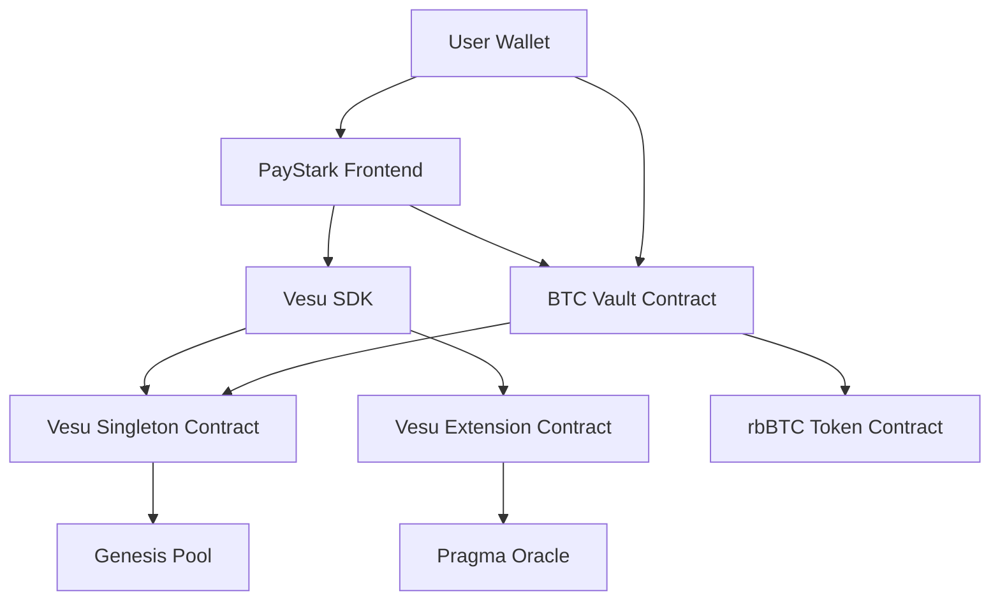

# 🚀 **Numo Vault Contract**

## 🏗️ **Integration Architecture**



---

## 🔧 **Integration Components**

### 1. **Enhanced Cairo Contract** (`apps/contracts/src/btc_vault.cairo`)

**Key Features:**

* ✅ **Hardcoded Sepolia addresses**
* ✅ **Fee system** (deposit, withdrawal, performance)
* ✅ **Vault management functions** (pause, fees, etc.)
* ✅ **Integration with price oracles**
* ✅ **Detailed events** for tracking
* ✅ **Security validations**

**Used Sepolia Addresses:**

```cairo
// Vesu Singleton V2 (Real Sepolia address)
singleton: 0x2110b3cde727cd34407e257e1070857a06010cf02a14b1ee181612fb1b61c30

// Extension PO V2 (Real Sepolia address)
extension: 0x274669f178d303cdd92638ab2aee6d5cb75d72baf79606a02b749552fc17759

// WBTC on Sepolia (Real address)
wbtc: 0x63d32a3fa6074e72e7a1e06fe78c46a0c8473217773e19f11d8c8cbfc4ff8ca

// Genesis Pool ID (Real Sepolia pool)
pool_id: 566154675190438152544449762131613456939576463701265245209877893089848934391
```

### 3. **Frontend Constants for Future Use**

```typescript
// Sepolia and Mainnet addresses
export const VESU_SEPOLIA_ADDRESSES = { /* ... */ };
export const VESU_MAINNET_ADDRESSES = { /* ... */ };

// Helper to get contract address
export function getVesuAddress(contract: string): string {
  return CURRENT_NETWORK.addresses[contract];
}
```

---

## 🚀 **How to Use the Integration**

### **Step 1: Compile and Deploy the Contract**

```bash
cd apps/contracts
scarb build

# Deploy to Sepolia
starknet deploy --contract target/dev/btc_vault.sierra.json \
  --inputs [OWNER_ADDRESS] [WBTC_ADDRESS] [POOL_ID] [RBBTC_ADDRESS] \
  --network sepolia
```

### **Step 3: Connect Wallet and Use**

1. **Connect your Starknet wallet** (Argent, Braavos)
2. **View pool metrics** and your position
3. **Deposit WBTC** to start generating yield
4. **Monitor returns** in real-time
5. **Withdraw funds** whenever you want

---

## 📊 **Available Metrics and Data**

### **User Data:**

* Current position (collateral and debt)
* rbBTC token balance
* Transaction history

### **Pool Data:**

* Current lending APY
* Utilization rate
* Total collateral and debt
* Current WBTC price

### **Vault Data:**

* Total deposited
* Accumulated fees
* Status (paused/active)
* Fee configuration

---

## 🔐 **Security Implementations**

### **In the Cairo Contract:**

* ✅ **Access control** (only owner for critical functions)
* ✅ **Emergency pause**
* ✅ **Minimum amount validation**
* ✅ **Fee limits** (max 10%/20%)
* ✅ **Balance checks** before transfers

### **In the Frontend:**

* ✅ **Input validation**
* ✅ **Error handling**
* ✅ **Transaction timeouts**
* ✅ **Wallet connection verification**

---

## 🚧 **Next Steps**

### **1. Additional Features:**

```cairo
// Automatic rebalance function
fn auto_rebalance(ref self: ContractState) -> bool

// Integration with multiple pools
fn add_pool(ref self: ContractState, pool_id: felt252, allocation: u256)

// Rewards system
fn claim_rewards(ref self: ContractState) -> u256
```

### **2. Optimizations:**

* **Dynamic share price calculation** based on accumulated yield
* **Integration with multiple assets** (ETH, USDC, USDT)
* **Automatic rebalance strategies**
* **Governance system** for vault parameters

---

## 🌐 **Resources and Links**

### **Vesu Documentation:**

* [Official Docs](https://docs.vesu.xyz/)
* [Contract Addresses](https://docs.vesu.xyz/dev-guides/contract-addresses)
* [API Reference](https://api.vesu.xyz/)

### **Starknet Resources:**

* [Starknet Docs](https://docs.starknet.io/)
* [Cairo Book](https://book.cairo-lang.org/)
* [Starknet.js](https://starknetjs.com/)

---

## ⚡ **Testing and Deployment**

```bash
# Cairo contract tests
cd apps/contracts
scarb test
```

**Numo Team!**
