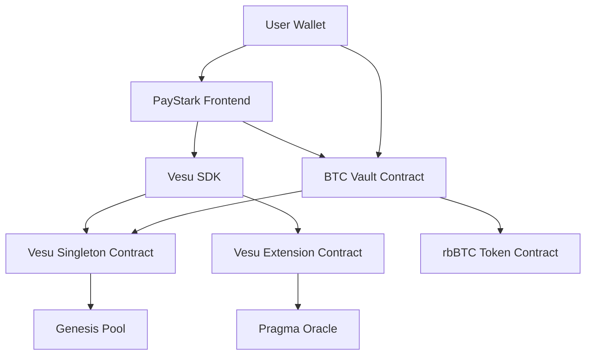

# 🚀 **Numo Vault Contract**

## 🏗️ **Arquitectura de la Integración**



---

## 🔧 **Componentes de la Integración**

### 1. **Contrato Cairo Mejorado** (`apps/contracts/src/btc_vault.cairo`)

**Características principales:**
- ✅ **Direcciones hardcodeadas de Sepolia**
- ✅ **Sistema de fees (depósito, retiro, performance)**
- ✅ **Funciones de gestión del vault** (pausar, fees, etc.)
- ✅ **Integración con oráculos** de precios
- ✅ **Eventos detallados** para tracking
- ✅ **Validaciones de seguridad**

**Direcciones de Sepolia utilizadas:**
```cairo
// Singleton de Vesu
singleton: 0x01ecab07456147a8de92b9273dd6789893401e8462a737431493980d9be6827

// Extension (Pragma Oracle)  
extension: 0x0571efca8cae0e426cb7052dad04badded0855b4cd6c6f475639af3356bc33fe

// WBTC en Sepolia
wbtc: 0xabbd6f1e590eb83addd87ba5ac27960d859b1f17d11a3c1cd6a0006704b1410

// Genesis Pool ID
pool_id: 730993554056884283224259059297934576024721456828383733531590831263129347422
```

### 3. **Constantes Futuras en el Frontend**

```typescript
// Direcciones para Sepolia y Mainnet
export const VESU_SEPOLIA_ADDRESSES = { /* ... */ };
export const VESU_MAINNET_ADDRESSES = { /* ... */ };

// Helper para obtener direcciones
export function getVesuAddress(contract: string): string {
  return CURRENT_NETWORK.addresses[contract];
}
```

---

## 🚀 **Cómo Usar la Integración**

### **Paso 1: Compilar y Desplegar el Contrato**

```bash
cd apps/contracts
scarb build

# Desplegar en Sepolia
starknet deploy --contract target/dev/btc_vault.sierra.json \
  --inputs [OWNER_ADDRESS] [WBTC_ADDRESS] [POOL_ID] [RBBTC_ADDRESS] \
  --network sepolia
```

### **Paso 3: Conectar Wallet y Usar**

1. **Conectar wallet** Starknet (Argent, Braavos)
2. **Visualizar métricas** del pool y tu posición
3. **Depositar WBTC** para empezar a generar yield
4. **Monitorear rendimientos** en tiempo real
5. **Retirar fondos** cuando lo desees

---

## 📊 **Métricas y Datos Disponibles**

### **Datos del Usuario:**
- Posición actual (colateral y deuda)
- Balance de rbBTC tokens
- Historial de transacciones

### **Datos del Pool:**
- APY actual de lending
- Tasa de utilización
- Total de colateral y deuda
- Precio actual de WBTC

### **Datos del Vault:**
- Total depositado
- Fees acumulados
- Estado (pausado/activo)
- Configuración de fees

---

## 🔐 **Seguridad Implementada**

### **En el Contrato Cairo:**
- ✅ **Control de acceso** (solo owner para funciones críticas)
- ✅ **Pausado de emergencia**
- ✅ **Validación de amounts mínimos**
- ✅ **Límites en fees** (máximo 10%/20%)
- ✅ **Checks de balances** antes de transfers

### **En el Frontend:**
- ✅ **Validación de inputs**
- ✅ **Manejo de errores**
- ✅ **Timeouts en transacciones**
- ✅ **Verificación de conexión de wallet**

---

## 🚧 **Próximos Pasos**

### **1. Funcionalidades Adicionales:**
```cairo
// Función de rebalance automático
fn auto_rebalance(ref self: ContractState) -> bool

// Integración con múltiples pools
fn add_pool(ref self: ContractState, pool_id: felt252, allocation: u256)

// Sistema de recompensas
fn claim_rewards(ref self: ContractState) -> u256
```

### **2. Optimizaciones:**
- **Cálculo dinámico de share price** basado en yields acumulados
- **Integración con múltiples activos** (ETH, USDC, USDT)
- **Estrategias de rebalance** automático
- **Sistema de governance** para parámetros del vault

---

## 🌐 **Recursos y Enlaces**

### **Vesu Documentation:**
- [Docs oficiales](https://docs.vesu.xyz/)
- [Contract addresses](https://docs.vesu.xyz/dev-guides/contract-addresses)
- [API Reference](https://api.vesu.xyz/)

### **Starknet Resources:**
- [Starknet Docs](https://docs.starknet.io/)
- [Cairo Book](https://book.cairo-lang.org/)
- [Starknet.js](https://starknetjs.com/)

---

## ⚡ **Testing y Deployment**
```bash
# Tests del contrato Cairo
cd apps/contracts
scarb test
```

**¡Numo Team!** 